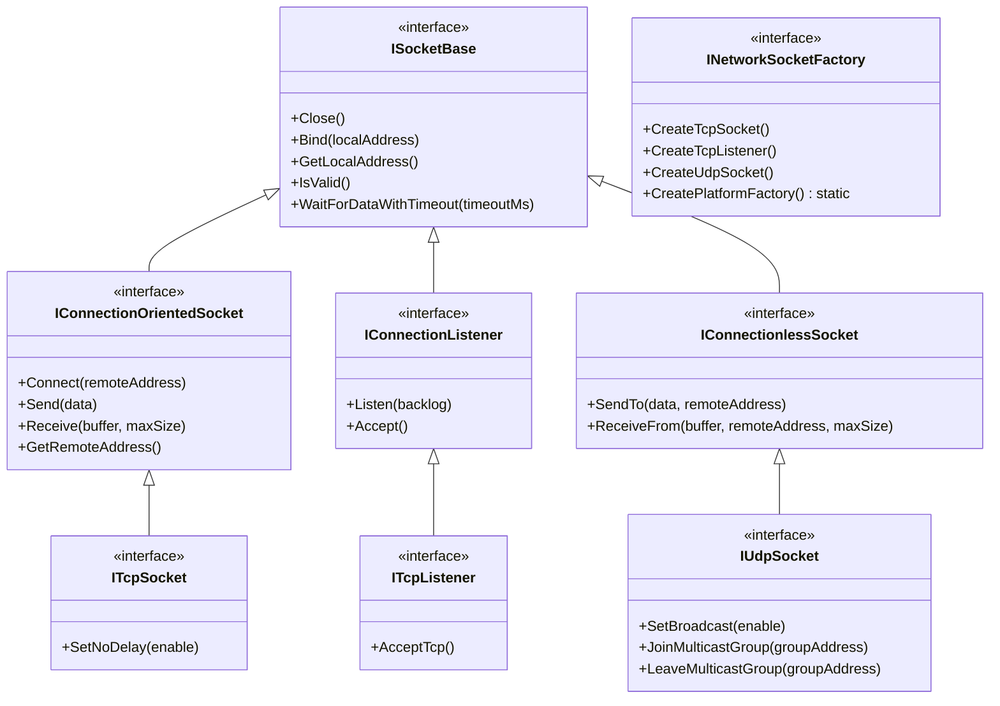

# TCP/UDP Connection Library

A cross-platform C++ networking library that provides abstractions for TCP and UDP socket communications.

## Features

- Abstract interfaces for TCP and UDP sockets
- Platform-specific implementations for Windows and Unix
- Factory pattern to create appropriate socket implementations
- Simple API for network communications
- Comprehensive test suite using Google Test framework
- Specialized timeout functionality for non-blocking operations
- Live chat application examples using TCP and UDP sockets

## Requirements

- C++20 compatible compiler
- CMake 3.14 or higher
- For Windows builds: Windows SDK
- For Unix builds: POSIX socket libraries

## Building the Project

This project uses CMake as its build system. Here's how to build it:

```bash
mkdir -p build
cd build
cmake ..
make
```

To build in release mode:

```bash
cmake -DCMAKE_BUILD_TYPE=Release ..
make
```

## Running Tests

The library includes a comprehensive test suite built with Google Test:

```bash
cd build
ctest
# or run the test executable directly
./tests/network_tests
```

## Examples

The library comes with example applications that demonstrate basic usage:

```bash
cd build
# Run TCP examples
./examples/example_tcp_server
./examples/example_tcp_client

# Run UDP examples
./examples/example_udp_sender
./examples/example_udp_receiver
./examples/example_udp_broadcast
./examples/example_udp_multicast

# Run live chat applications
./app/tcp_live_chat_server
./app/tcp_live_chat_client [server_ip] [port]
./app/udp_live_chat_server
./app/udp_live_chat_client [server_ip] [port]
```

These examples show how to:
- Set up TCP servers and clients
- Send and receive UDP datagrams
- Work with UDP broadcast and multicast
- Handle different networking scenarios
- Implement non-blocking operations with timeouts
- Create real-time chat applications with both TCP and UDP protocols

## Project Structure

```
tcp_udp_connection/
├── CMakeLists.txt                 # Main CMake file
├── README.md                      # Project documentation
├── app/                           # Live chat applications
│   ├── CMakeLists.txt             # App build configuration
│   ├── tcp_live_chat_client.cpp   # TCP chat client implementation
│   ├── tcp_live_chat_server.cpp   # TCP chat server implementation
│   ├── udp_live_chat_client.cpp   # UDP chat client implementation
│   └── udp_live_chat_server.cpp   # UDP chat server implementation
├── include/                       # Public API headers
│   └── network/                   # Library namespace
│       ├── network.h              # Core networking abstractions
│       ├── tcp_socket.h           # TCP-specific interfaces
│       ├── udp_socket.h           # UDP-specific interfaces
│       └── platform_factory.h     # Factory interface
├── src/                           # Implementation files
│   ├── CMakeLists.txt             # Library build configuration
│   ├── platform_factory.cpp       # Factory implementation
│   ├── unix/                      # Unix-specific implementations
│   │   ├── CMakeLists.txt         # Unix build configuration
│   │   ├── unix_sockets.h         # Unix internal header
│   │   └── unix_sockets.cpp       # Unix implementation
│   └── windows/                   # Windows-specific implementations
│       ├── CMakeLists.txt         # Windows build configuration
│       ├── windows_sockets.h      # Windows internal header
│       └── windows_sockets.cpp    # Windows implementation
├── tests/                         # Test suite
│   ├── CMakeLists.txt             # Test build configuration
│   ├── tcp_socket_test.cpp        # TCP socket tests
│   ├── tcp_timeout_test.cpp       # TCP timeout functionality tests
│   ├── udp_socket_test.cpp        # UDP socket tests
│   └── udp_timeout_test.cpp       # UDP timeout functionality tests
└── examples/                      # Example applications
    ├── CMakeLists.txt             # Examples build configuration
    ├── examples.cpp               # Common examples code
    ├── tcp_client.cpp             # TCP client example
    ├── tcp_server.cpp             # TCP server example
    ├── udp_broadcast.cpp          # UDP broadcast example
    ├── udp_multicast.cpp          # UDP multicast example
    ├── udp_receiver.cpp           # UDP receiver example
    └── udp_sender.cpp             # UDP sender example
```

## Cross-Platform Support

The library is designed to work seamlessly across different platforms:

- **Windows**: Uses Winsock2 API
- **Unix/Linux/macOS**: Uses POSIX sockets API

The platform-specific implementations are automatically selected at compile time.

## Interface Design

The library is architected around clean abstractions with a focus on ease of use and platform independence:

### Core Interfaces

#### Network Address (`NetworkAddress`)
A struct to hold IP address and port information.

```cpp
// filepath: include/network/network.h
// ...
struct NetworkAddress {
    std::string ipAddress;
    unsigned short port;
    NetworkAddress(const std::string& ip = "", unsigned short p = 0);
};
// ...
```

#### Base Socket Interface (`ISocketBase`)
Provides common functionality for all socket types.

```cpp
// filepath: include/network/network.h
// ...
class ISocketBase {
public:
    virtual ~ISocketBase() = default;
    virtual void Close() = 0;
    virtual bool Bind(const NetworkAddress& localAddress) = 0;
    virtual NetworkAddress GetLocalAddress() const = 0;
    virtual bool IsValid() const = 0;
    virtual bool WaitForDataWithTimeout(int timeoutMs) = 0;
};
// ...
```

#### Connection-Oriented Sockets (`IConnectionOrientedSocket`, `IConnectionListener`)
Interfaces for sockets that establish a connection before data transfer (like TCP).

```cpp
// filepath: include/network/network.h
// ...
class IConnectionOrientedSocket : public ISocketBase {
public:
    virtual bool Connect(const NetworkAddress& remoteAddress) = 0;
    virtual int Send(const std::vector<char>& data) = 0;
    virtual int Receive(std::vector<char>& buffer, int maxSize = -1) = 0;
    virtual NetworkAddress GetRemoteAddress() const = 0;
};

class IConnectionListener : public ISocketBase {
public:
    virtual bool Listen(int backlog) = 0;
    virtual std::unique_ptr<IConnectionOrientedSocket> Accept() = 0;
};
// ...
```

#### Connectionless Sockets (`IConnectionlessSocket`)
Interface for sockets that send data without establishing a connection (like UDP).

```cpp
// filepath: include/network/network.h
// ...
class IConnectionlessSocket : public ISocketBase {
public:
    virtual int SendTo(const std::vector<char>& data, const NetworkAddress& remoteAddress) = 0;
    virtual int ReceiveFrom(std::vector<char>& buffer, NetworkAddress& remoteAddress, int maxSize = -1) = 0;
};
// ...
```

#### TCP Specific Interfaces (`ITcpSocket`, `ITcpListener`)
Concrete interfaces inheriting from the connection-oriented base interfaces, potentially adding TCP-specific methods.

```cpp
// filepath: include/network/tcp_socket.h
// ...
class ITcpSocket : public IConnectionOrientedSocket {
public:
    virtual bool SetNoDelay(bool enable) = 0;
};

class ITcpListener : public IConnectionListener {
public:
    virtual std::unique_ptr<IConnectionOrientedSocket> Accept() override = 0;
    virtual std::unique_ptr<ITcpSocket> AcceptTcp();
};
// ...
```

#### UDP Specific Interface (`IUdpSocket`)
Concrete interface inheriting from the connectionless base interface, adding UDP-specific methods.

```cpp
// filepath: include/network/udp_socket.h
// ...
class IUdpSocket : public IConnectionlessSocket {
public:
    virtual bool SetBroadcast(bool enable) = 0;
    virtual bool JoinMulticastGroup(const NetworkAddress& groupAddress) = 0;
    virtual bool LeaveMulticastGroup(const NetworkAddress& groupAddress) = 0;
};
// ...
```

#### Factory Pattern (`INetworkSocketFactory`)
An abstract factory creates the appropriate socket implementation based on the current platform.

```cpp
// filepath: include/network/platform_factory.h
// ...
class INetworkSocketFactory {
public:
    virtual ~INetworkSocketFactory() = default;
    virtual std::unique_ptr<ITcpSocket> CreateTcpSocket() = 0;
    virtual std::unique_ptr<ITcpListener> CreateTcpListener() = 0;
    virtual std::unique_ptr<IUdpSocket> CreateUdpSocket() = 0;

    static std::unique_ptr<INetworkSocketFactory> CreatePlatformFactory();
};
// ...
```

### Design Principles

1.  **Abstraction**: Platform-specific details are hidden behind common interfaces (`ISocketBase`, `IConnectionOrientedSocket`, `IConnectionListener`, `IConnectionlessSocket`) and concrete interfaces (`ITcpSocket`, `ITcpListener`, `IUdpSocket`).
2.  **RAII**: Socket resources are managed using `std::unique_ptr`, ensuring automatic cleanup.
3.  **Platform Independence**: The `INetworkSocketFactory` provides the correct platform-specific socket implementations transparently via `CreatePlatformFactory()`.
4.  **Minimal Dependencies**: Relies only on standard C++ libraries and platform socket APIs (Winsock/POSIX).
5.  **Consistent API**: Core operations are accessed through the base interfaces, promoting similar usage patterns.

### Usage Patterns

#### TCP Client/Server Model

```cpp
// Get the platform-specific factory
auto factory = INetworkSocketFactory::CreatePlatformFactory();

// TCP Server example
auto listener = factory->CreateTcpListener();
NetworkAddress serverAddr("0.0.0.0", 8080); // Listen on all interfaces, port 8080
if (listener->Bind(serverAddr) && listener->Listen(5)) {
    std::cout << "Server listening on port 8080..." << std::endl;
    auto clientConnection = listener->AcceptTcp(); // Accept a TCP connection (returns ITcpSocket)
    if (clientConnection && clientConnection->IsValid()) {
        std::cout << "Client connected from " << clientConnection->GetRemoteAddress().ipAddress << std::endl;
        // ... handle client communication ...
        clientConnection->Close();
    }
} else {
    std::cerr << "Failed to start server." << std::endl;
}

// TCP Client example
auto clientSocket = factory->CreateTcpSocket();
NetworkAddress serverTarget("127.0.0.1", 8080);
if (clientSocket->Connect(serverTarget)) {
    std::cout << "Connected to server." << std::endl;
    std::vector<char> data = {'H', 'e', 'l', 'l', 'o'};
    clientSocket->Send(data);
    // ... receive response ...
    clientSocket->Close();
} else {
    std::cerr << "Failed to connect to server." << std::endl;
}
```

#### UDP Communication Model

```cpp
// Get the platform-specific factory
auto factory = INetworkSocketFactory::CreatePlatformFactory();

// UDP Sender/Receiver example
auto udpSocket = factory->CreateUdpSocket();
NetworkAddress localAddr("0.0.0.0", 9090); // Bind to specific local port
if (udpSocket->Bind(localAddr)) {
    std::cout << "UDP Socket bound to " << udpSocket->GetLocalAddress().port << std::endl;

    // Sending data
    std::vector<char> data = {'P', 'i', 'n', 'g'};
    NetworkAddress destAddr("192.168.1.100", 9090);
    udpSocket->SendTo(data, destAddr);

    // Receiving data
    std::vector<char> buffer;
    NetworkAddress senderAddr;
    if (udpSocket->WaitForDataWithTimeout(1000)) { // Wait 1 second
        udpSocket->ReceiveFrom(buffer, senderAddr);
        std::cout << "Received data from " << senderAddr.ipAddress << ":" << senderAddr.port << std::endl;
    }
    udpSocket->Close();
} else {
    std::cerr << "Failed to bind UDP socket." << std::endl;
}

// UDP Broadcast example
auto broadcastSocket = factory->CreateUdpSocket();
if (broadcastSocket->SetBroadcast(true)) {
    std::vector<char> broadcastData = {'B', 'r', 'o', 'a', 'd', 'c', 'a', 's', 't'};
    NetworkAddress broadcastAddr("255.255.255.255", 9999);
    broadcastSocket->SendTo(broadcastData, broadcastAddr);
    std::cout << "Sent broadcast message." << std::endl;
    broadcastSocket->Close();
}
```

### Error Handling

The library primarily uses return values (`bool` for success/failure, `int` for bytes sent/received where < 0 often indicates an error). Critical failures (e.g., socket creation, binding) might throw `std::runtime_error` or platform-specific exceptions, although the factory pattern aims to handle initial setup errors gracefully by returning `nullptr`. Check return values of methods like `Connect`, `Bind`, `Listen`, `Send`, `Receive`, `SendTo`, `ReceiveFrom`, and `IsValid`.

```cpp
// Get the platform-specific factory
auto factory = INetworkSocketFactory::CreatePlatformFactory();
if (!factory) {
    std::cerr << "Failed to create socket factory." << std::endl;
    return 1;
}

try {
    auto socket = factory->CreateTcpSocket();
    if (!socket) {
        std::cerr << "Failed to create TCP socket." << std::endl;
        return 1;
    }

    NetworkAddress serverAddr("127.0.0.1", 8080);
    if (!socket->Connect(serverAddr)) {
        std::cerr << "Failed to connect to server." << std::endl;
        // Further error details might require platform-specific checks (errno/WSAGetLastError)
        // if the boolean return isn't sufficient.
    } else {
        // Connection successful
        std::vector<char> data = {'T', 'e', 's', 't'};
        int bytesSent = socket->Send(data);
        if (bytesSent < 0) {
             std::cerr << "Failed to send data." << std::endl;
        }
        socket->Close();
    }
} catch (const std::exception& e) {
    // Catch potential exceptions from underlying operations if any are thrown
    std::cerr << "Caught exception: " << e.what() << std::endl;
}
```

## Class Hierarchy



*Note: Platform-specific implementation classes (e.g., `WindowsTcpSocket`, `UnixUdpSocket`) inherit from these interfaces but are not shown here for clarity. The `INetworkSocketFactory` is responsible for creating instances of the appropriate platform-specific classes.* 

## Advanced Features

### Non-blocking Operations with Timeout

Both TCP and UDP implementations support non-blocking operations with configurable timeouts:

```cpp
// Example of using timeout functionality
if (socket->WaitForDataWithTimeout(500)) { // Wait for 500ms
    // Data is available, receive it
    std::vector<char> buffer(1024);
    int bytesReceived = socket->Receive(buffer, buffer.size());
} else {
    // Timeout occurred, no data available
}
```

### Live Chat Applications

The library includes complete implementations of chat applications using both TCP and UDP protocols:

```bash
# Run the TCP chat server
./app/tcp_live_chat_server [port]

# Connect with the TCP chat client
./app/tcp_live_chat_client [server_ip] [port]

# Run the UDP chat server
./app/udp_live_chat_server [port]

# Connect with the UDP chat client
./app/udp_live_chat_client [server_ip] [port]
```

These applications demonstrate:
- Real-time text-based chat with multiple users
- Private messaging between users
- User presence notifications (join/leave)
- Signal handling for graceful termination
- Non-blocking socket operations with timeouts

## License

This project is available under the MIT License.

## Last Updated

April 15, 2025
